

  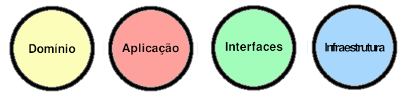

<h1 align="center">
🚀 Clean Architecture Or  Hexagonal Architecture 🚀
</h1>

## Motivation
___
### Learn how to design modular applications
- Learning how to design modular applications will help you become a better engineer. Designing modular applications is the holy grail of software architecture, it is hard to find engineers experienced in designing applications which allows adding new features at a steady speed.

### Explore the .NET Core features
- .NET Core brings a sweet development environment, an extensible and cross-platform framework. We will explore the benefits of it in the infrastructure layer and we will reduce its importance in the application and domain layers. The same rule is applied for modern C# language syntax.

## Hexagonal Architecture Style
___

The general idea behind Hexagonal architecture style is that the dependencies (Adapters) required by the software to run are used behind an interface (Port).  

The software is divided into **Application** and **Infrastructure** in which the adapters are interchangeable components developed and tested in isolation. The Application is loosely coupled to the Adapters and their implementation details.

#### Ports

Interfaces like `ICustomerRepository`, `IOutputPort` and `IUnitOfWork` are ports required by the application.

#### Adapters

The interface implementations, they are specific to a technology and bring external capabilities. For instance the `CustomerRepository` inside the `EntityFrameworkDataAccess` folder provides capabilities to consume an SQL Server database.

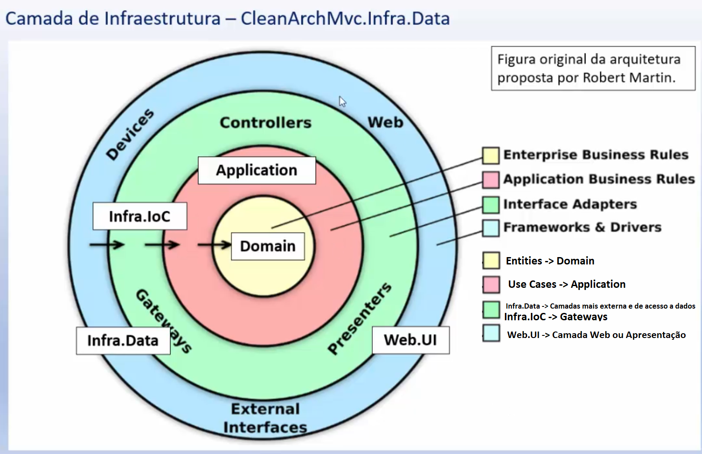

#### The Left Side

Primary Actors are usually the user interface or the Test Suit.

#### The Right Side

The Secondary Actors are usually Databases, Cloud Services or other systems.

### Onion Architecture Style

Very similar to Ports and Adapters, I would add that data objects cross boundaries as simple data structures. For instance, when the controller execute a use case it passes an immutable Input message. When the use cases calls a Presenter it gives an Output message (Data Transfer Objects if you like).

### Clean Architecture Style

The Clean Architecture style focus on a loosely coupled implementation of use cases and it is summarized as:

1. It is an architecture style that the Use Cases are the central organizing structure.
1. Follows the Ports and Adapters pattern.
   * The implementation is guided by tests (TDD Outside-In).
   * Decoupled from technology details.
1. Follows lots of principles (Stable Abstractions Principle, Stable Dependencies Principle, SOLID and so on).

## Layers Definition This Project
---

Relation and dependency between projects:
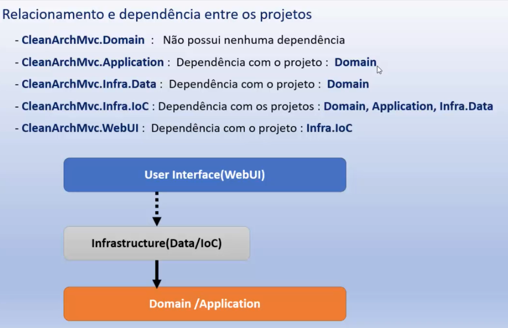

Layer Domain or Entities
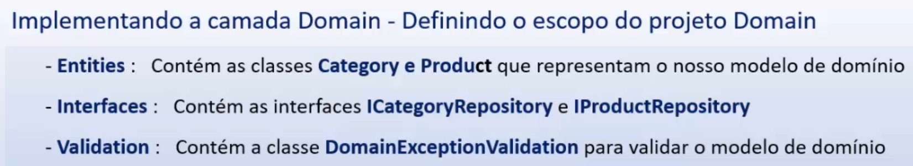

Layer Application or Use Cases
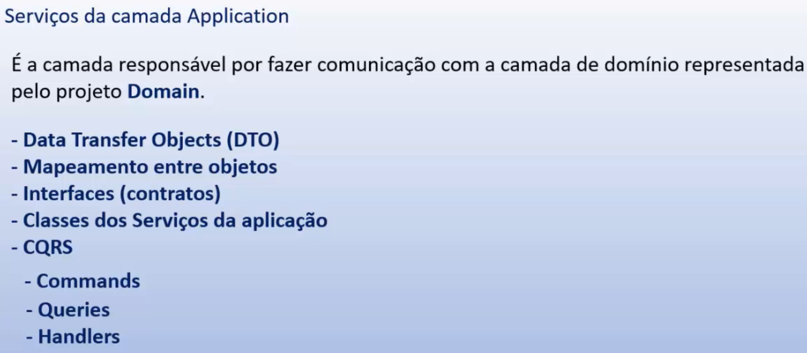

Layer Application with Services to Mapper and Convertion Objects
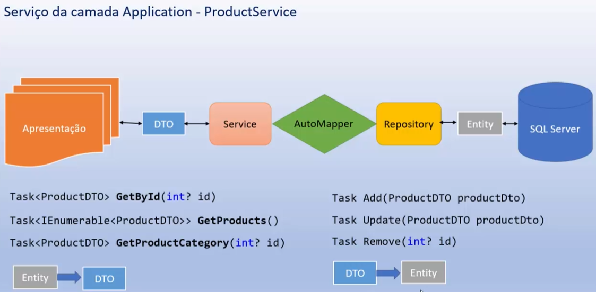

Layer Infra
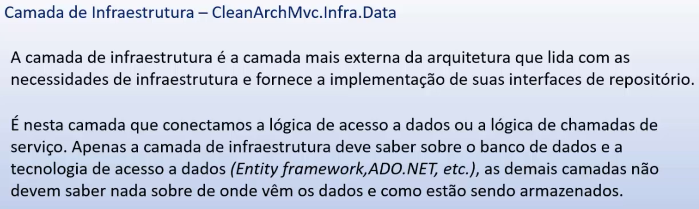

Layer Infra.Data
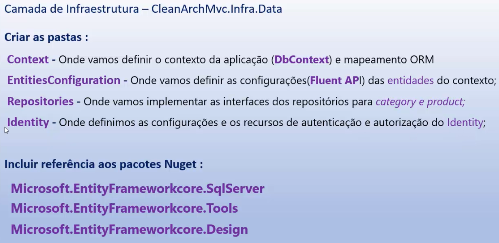

Layer Domain X Infra.Data
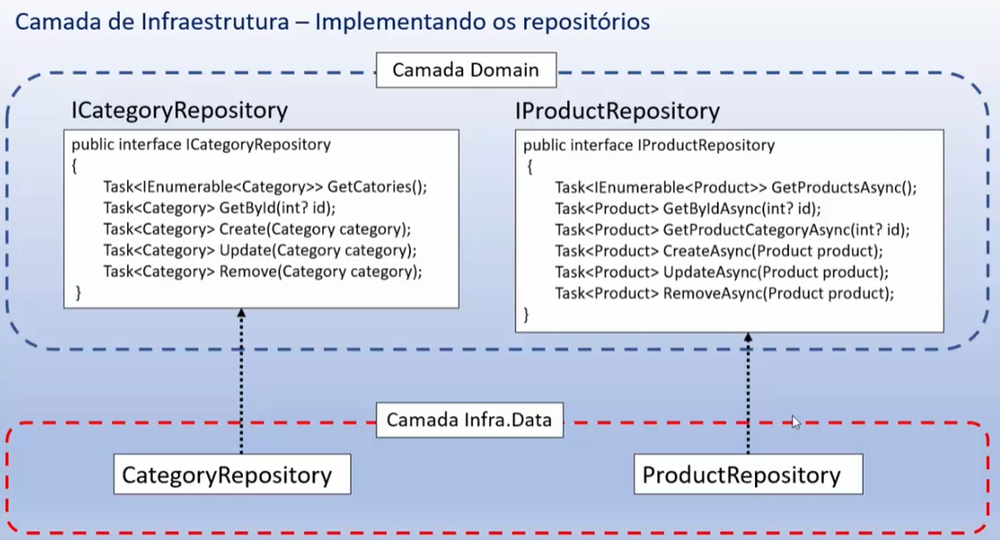

Layer Infra.IoC
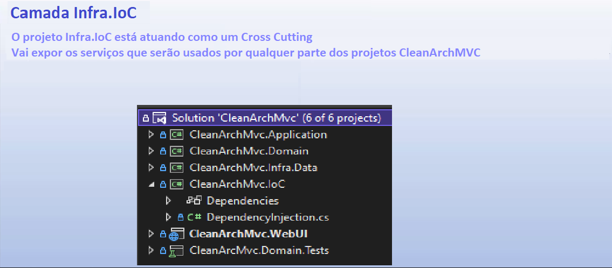

Layer Web.UI
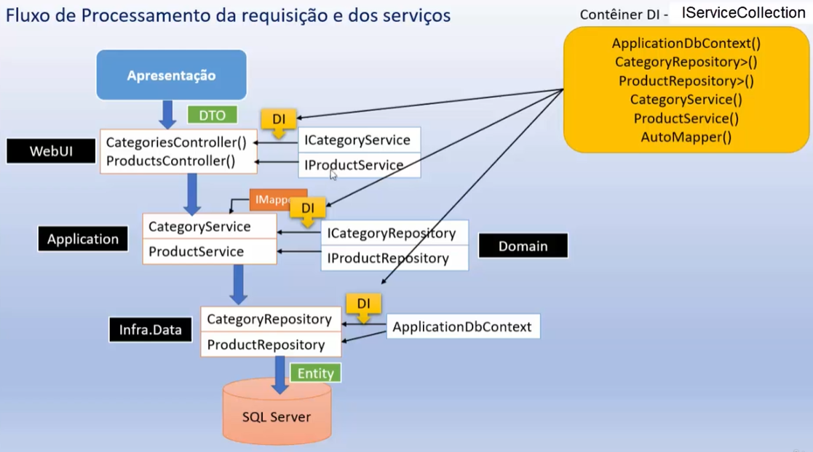

## CQRS - Command Query Responsability Separation
---

### Concerns
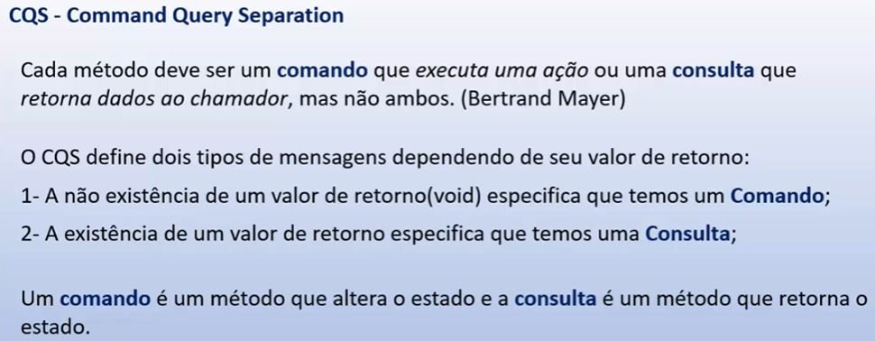

### CQRS - How to use
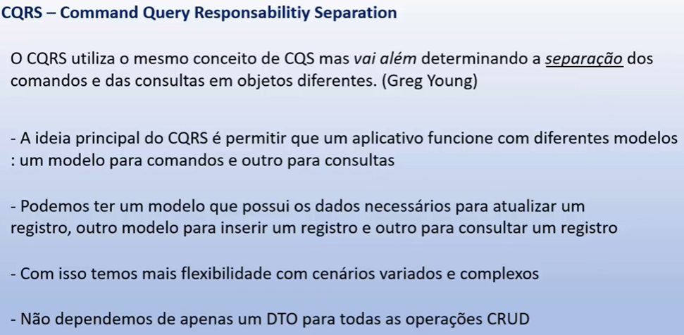

### Implementation And When Not To Use
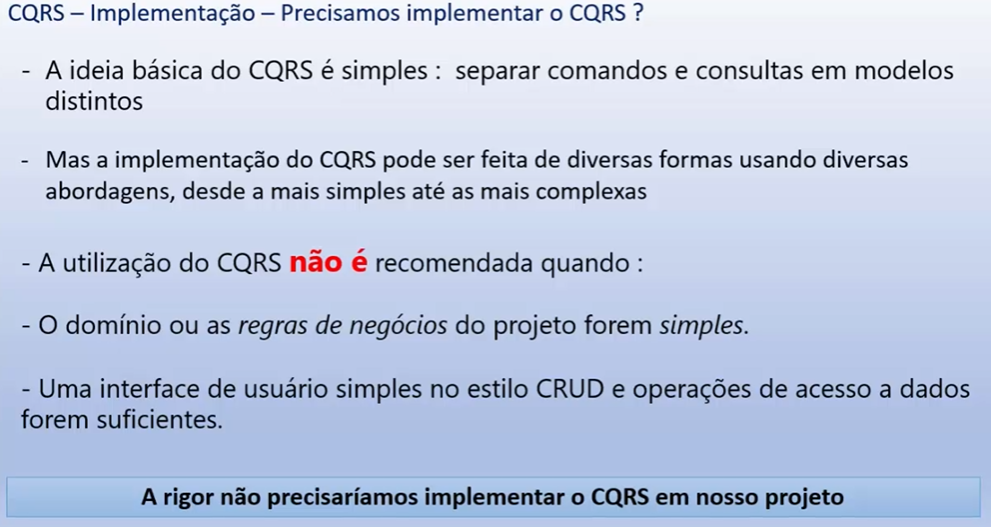

### CQRS And Use Mediator Pattern
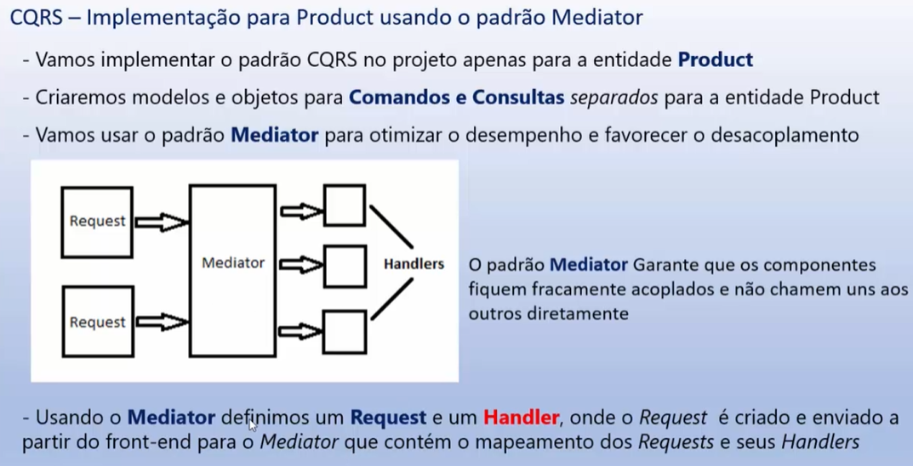

### CQRS Implementation Class
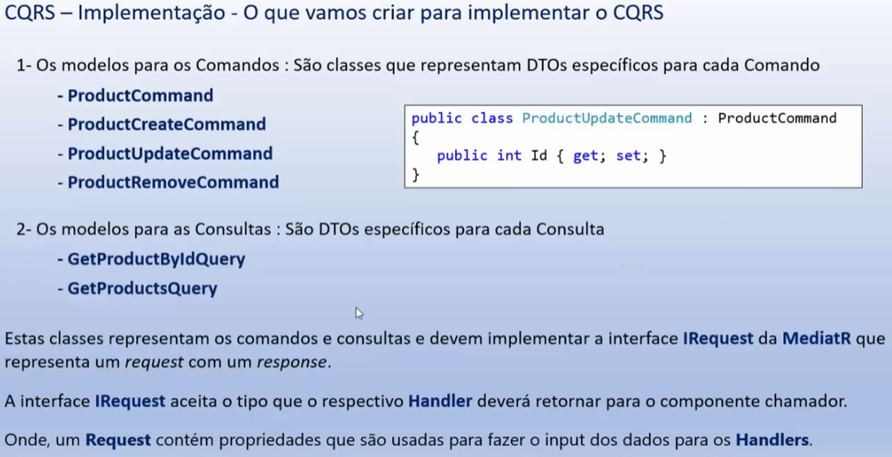

### CQRS Handlers
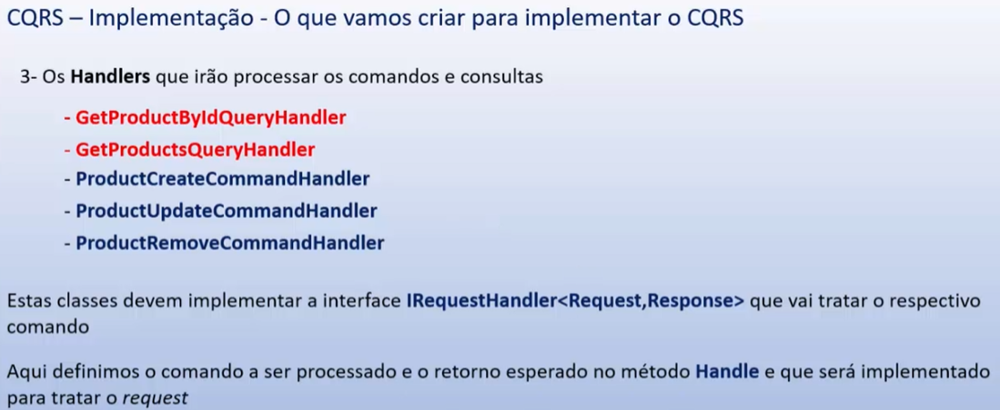

### CQRS Handlers X Mediator Pattern X Requests
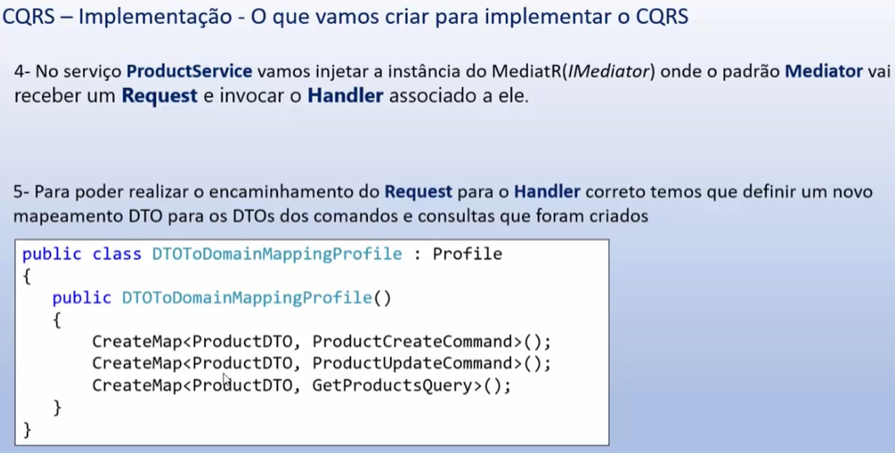

### CQRS Handlers X Mediator 
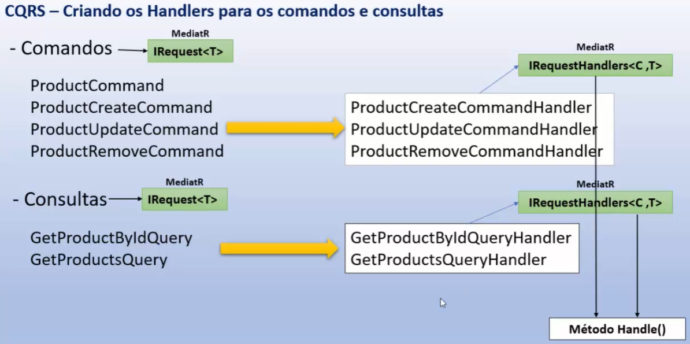

### CQRS Fluxo das Requests
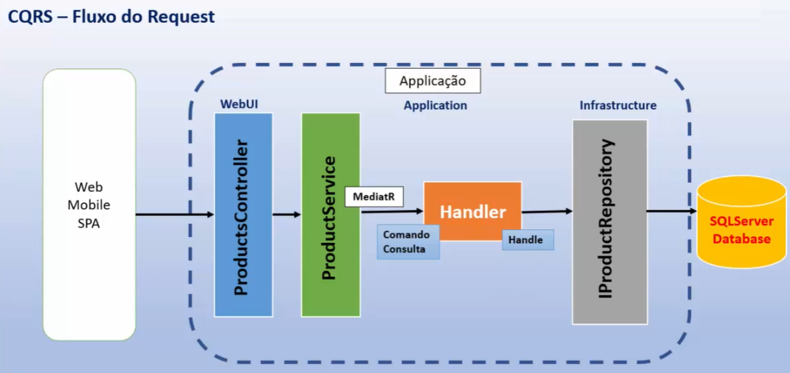

### CQRS Comparando os Fluxos (Sem/Com o CQRS)
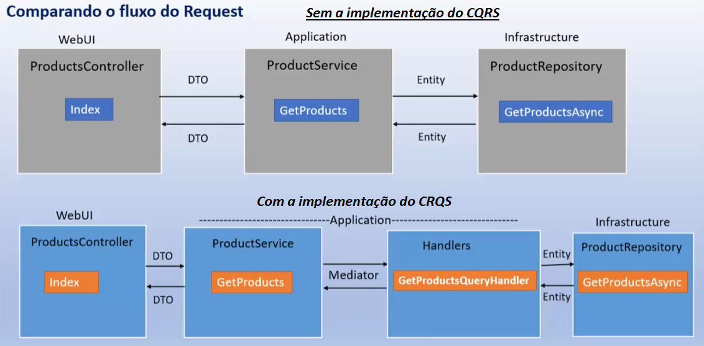

> Todos os créditos são do professor @Macorrati | 
Feito com ❤️ por Douglas Lima </h2> [Entre em contato!](https://www.linkedin.com/in/douglasproglima)